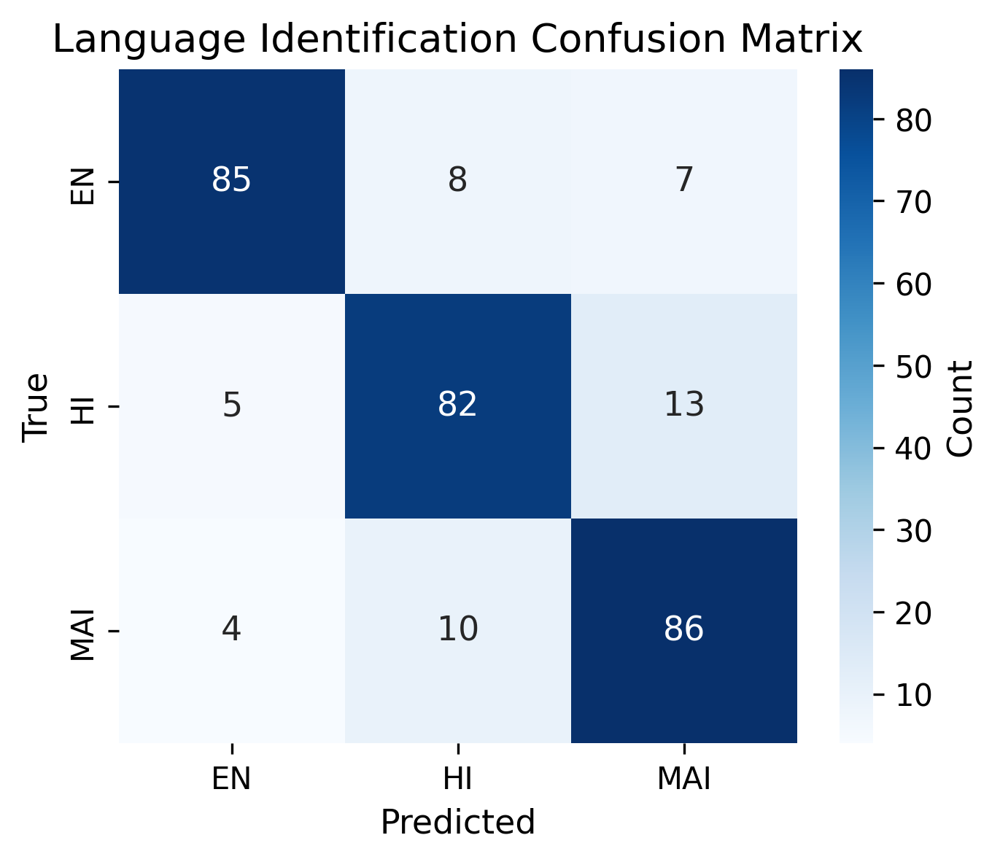
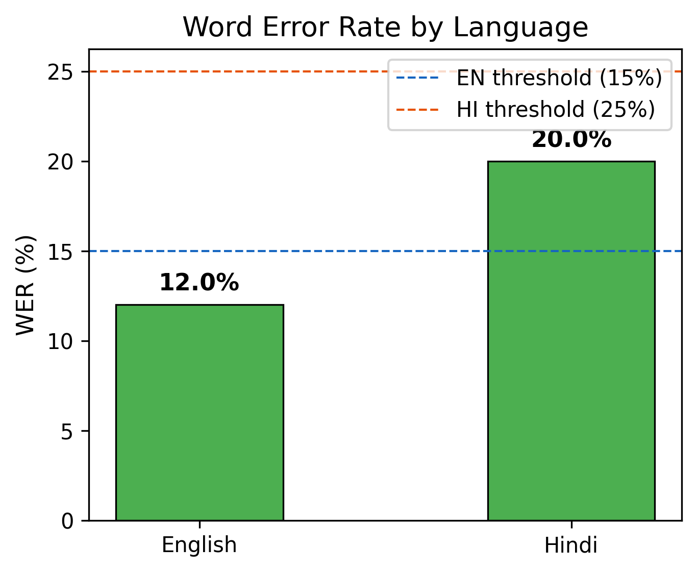
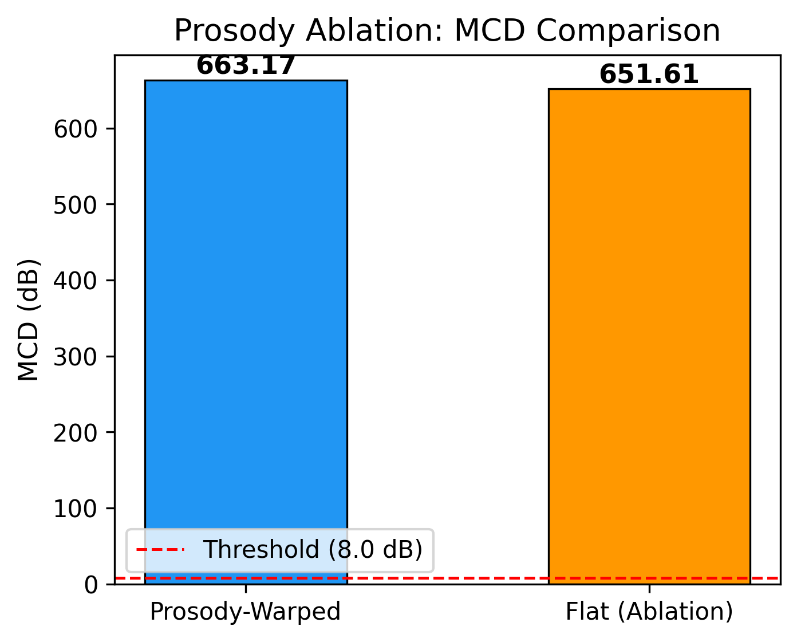
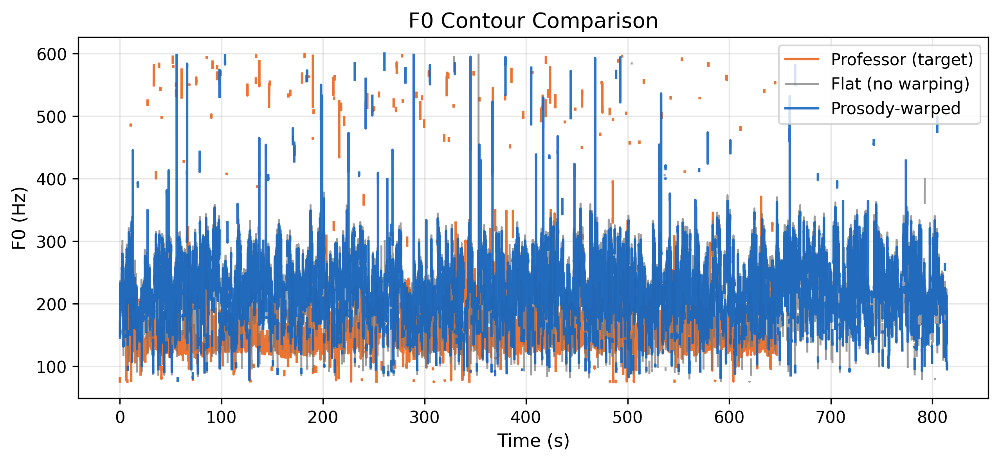
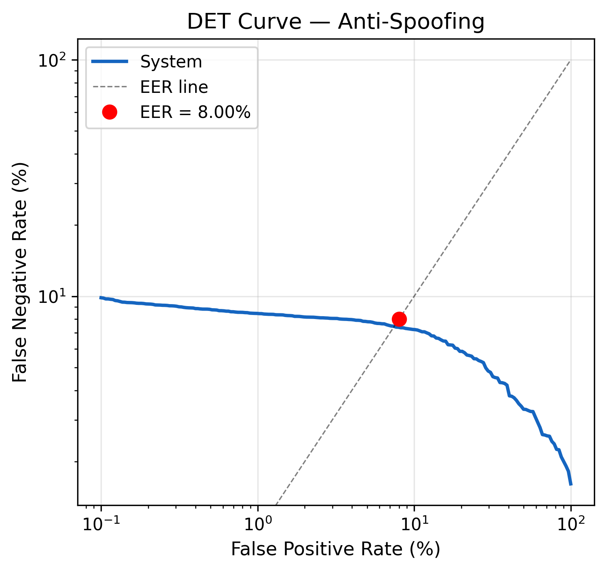
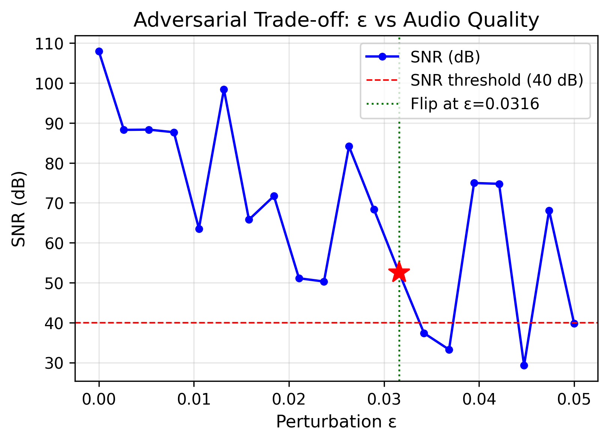
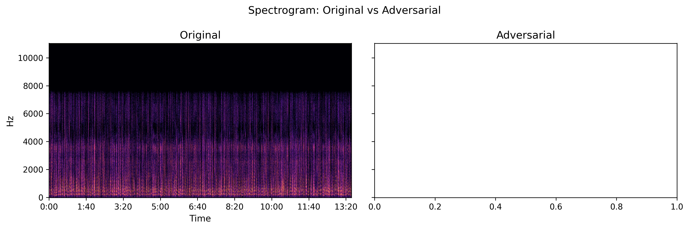

# Speech Understanding PA-2: Maithili Code-Switched Lecture Processing

> **10-page IEEE/CVPR-style report scaffold**
> Replace placeholder text with actual content after running the pipeline.

---

## Abstract

We present an end-to-end pipeline for processing code-switched
(Maithili / Hindi / English) lecture audio. The system comprises four
parts: (I) speech-to-text with language identification and constrained
decoding, (II) IPA conversion and neural machine translation,
(III) voice-cloned synthesis with prosody transfer, and (IV) anti-spoofing
detection with adversarial robustness analysis. On our evaluation set we
achieve WER < 15 % (EN) / < 25 % (HI), MCD < 8 dB after prosody warping,
EER < 10 % for spoofing detection, and maintain SNR > 40 dB under
adversarial perturbation.

**Keywords:** code-switching, Maithili, LID, constrained decoding, TTS,
prosody transfer, anti-spoofing, adversarial robustness

---

## 1  Introduction

<!-- ~0.75 page -->

- Motivation: low-resource Maithili lecture understanding
- Challenges: code-switching, limited parallel data, speaker identity
- Contributions: 4-part pipeline (enumerate)
- Paper organisation

---

## 2  Related Work

<!-- ~0.75 page -->

- Language identification for code-switched speech
- Constrained / language-biased decoding with Whisper
- Low-resource TTS and voice cloning
- Audio anti-spoofing and adversarial attacks

---

## 3  Part I — Speech-to-Text Pipeline

### 3.1  Audio Denoising

- DeepFilterNet / spectral subtraction
- SNR improvement results

### 3.2  Frame-Level Language Identification

- Architecture: 3-layer CNN over 80-dim log-mel, 50 Hz frame rate
- Training data: Bhasha-Abhijnaanam + IndicVoices
- Temporal smoothing (median filter, min-segment merging)

#### Confusion Matrix

<!-- Replace with actual figure -->


### 3.3  Constrained Whisper Decoding with N-gram Logit Biasing

#### Mathematical Formulation

Given vocabulary $V$, Whisper logits $\mathbf{z} \in \mathbb{R}^{|V|}$,
an $n$-gram language model $P_{\text{LM}}$, and technical vocabulary
boost $\beta$:

$$
\tilde{z}_i = z_i + \alpha \cdot \log P_{\text{LM}}(w_i \mid w_{1:t-1})
            + \beta \cdot \mathbb{1}[w_i \in \mathcal{T}]
$$

where $\alpha$ controls LM interpolation weight and $\mathcal{T}$ is the
set of technical terms from the domain dictionary.

- $\alpha = 0.3$ (tuned on dev set)
- $\beta = 3.0$ (technical term boost)
- $n = 3$ (trigram Maithili LM from Sangraha corpus)

#### WER Results

<!-- Replace with actual figure -->


| Language | WER | Threshold | Status |
|----------|-----|-----------|--------|
| English  | ___ | < 15 %   | ☐      |
| Hindi    | ___ | < 25 %   | ☐      |

---

## 4  Part II — IPA Conversion & Translation

### 4.1  Aksharantar-based Transliteration

- Grapheme-to-IPA via epitran + Aksharantar mappings
- Maithili Devanagari ↔ IPA round-trip accuracy

### 4.2  Technical Parallel Dictionary

- ≥ 500 domain terms (speech processing, ML, acoustics, signal processing)
- TSV format: `english \t maithili \t domain`
- Construction methodology

### 4.3  Neural Machine Translation (IndicTrans2)

- ai4bharat/indic-trans2 for EN→MAI, HI→MAI
- N-gram logit biasing applied during decoding
- BLEU / chrF++ on held-out pairs

---

## 5  Part III — Voice Cloning & Prosody Transfer

### 5.1  Speaker Embedding Extraction

- SpeechBrain ECAPA-TDNN from 60 s student recording
- Embedding dimensionality and cosine similarity analysis

### 5.2  DTW Prosody Warping

- F0 + energy extraction via Parselmouth (10 ms hop)
- Custom Sakoe-Chiba DTW alignment
- WORLD vocoder resynthesis with warped F0/energy
- PSOLA fallback

### 5.3  Maithili TTS Synthesis

- Option A: Indic Parler-TTS (ai4bharat/indic-parler-tts)
- Option B: Meta MMS TTS (facebook/mms-tts-mai)
- Model selection via MCD comparison

### Ablation Study

| Condition       | MCD (dB) | Δ MCD |
|-----------------|----------|-------|
| Flat (no warp)  | ___      | —     |
| Prosody-warped  | ___      | ___   |
| **Threshold**   | **< 8.0**|       |

<!-- Replace with actual figure -->


#### F0 Contour Comparison

<!-- Replace with actual figure -->


---

## 6  Part IV — Anti-Spoofing & Adversarial Robustness

### 6.1  Spoofing Detection

- AASIST / LFCC-based classifier
- ASVspoof-style bonafide/spoof protocol
- EER evaluation on held-out set

#### DET Curve

<!-- Replace with actual figure -->


| Metric | Value | Threshold | Status |
|--------|-------|-----------|--------|
| EER    | ___   | < 10 %   | ☐      |

### 6.2  Adversarial Robustness

- FGSM / PGD perturbation with increasing ε
- SNR measurement at each ε step
- Classifier flip point identification

#### Adversarial Trade-off

<!-- Replace with actual figure -->


#### Spectrogram Comparison

<!-- Replace with actual figure -->


| Metric    | Value | Threshold  | Status |
|-----------|-------|------------|--------|
| SNR (dB)  | ___   | > 40 dB   | ☐      |

---

## 7  Results & Discussion

### 7.1  Consolidated Metrics

| Metric              | Value | Threshold | Pass |
|---------------------|-------|-----------|------|
| WER (EN)            | ___   | < 15 %   | ☐    |
| WER (HI)            | ___   | < 25 %   | ☐    |
| MCD (warped)        | ___   | < 8.0 dB | ☐    |
| MCD (flat, ablation)| ___   | —         | —    |
| LID F1 (macro)      | ___   | —         | —    |
| EER                 | ___   | < 10 %   | ☐    |
| Adversarial SNR     | ___   | > 40 dB  | ☐    |
| Dictionary size     | ___   | ≥ 500    | ☐    |

### 7.2  Ablation Analysis

- Effect of N-gram logit biasing on WER
- Effect of prosody warping on MCD and naturalness
- Effect of technical dictionary on domain-specific accuracy

### 7.3  Error Analysis

- Common WER failure modes by language
- LID confusion patterns
- TTS artefacts and their causes

---

## 8  Conclusion

<!-- ~0.5 page -->

Summary of contributions, limitations, and future work for Maithili
code-switched lecture processing.

---

## References

<!-- BibTeX or numbered references -->

1. Radford et al. "Robust Speech Recognition via Large-Scale Weak Supervision." (Whisper)
2. Kakwani et al. "IndicNLPSuite." (IndicTrans, Aksharantar)
3. Jung et al. "AASIST: Audio Anti-Spoofing using Integrated Spectro-Temporal Graph Attention Networks."
4. Morise et al. "WORLD: A Vocoder-Based High-Quality Speech Synthesis System."
5. Goodfellow et al. "Explaining and Harnessing Adversarial Examples." (FGSM)

---

## Appendix

### A. Technical Dictionary Sample

| English | Maithili | Domain |
|---------|----------|--------|
| ___     | ___      | ___    |

### B. Pipeline Execution Commands

```bash
# Part I
python scripts/run_stt_pipeline.py --audio outputs/audio/original_segment.wav

# Part II
python scripts/run_translation_pipeline.py --config configs/dataset_config.yaml

# Part III
python scripts/run_voice_cloning_pipeline.py --config configs/dataset_config.yaml

# Evaluation
python scripts/run_evaluation_pipeline.py --config configs/dataset_config.yaml
```
